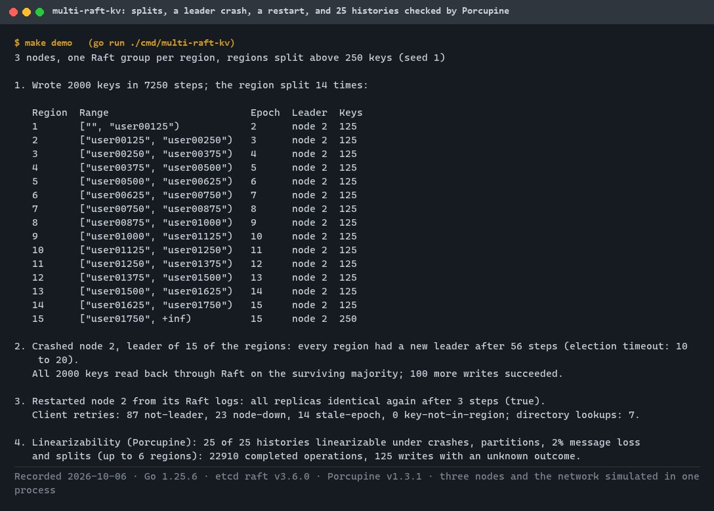
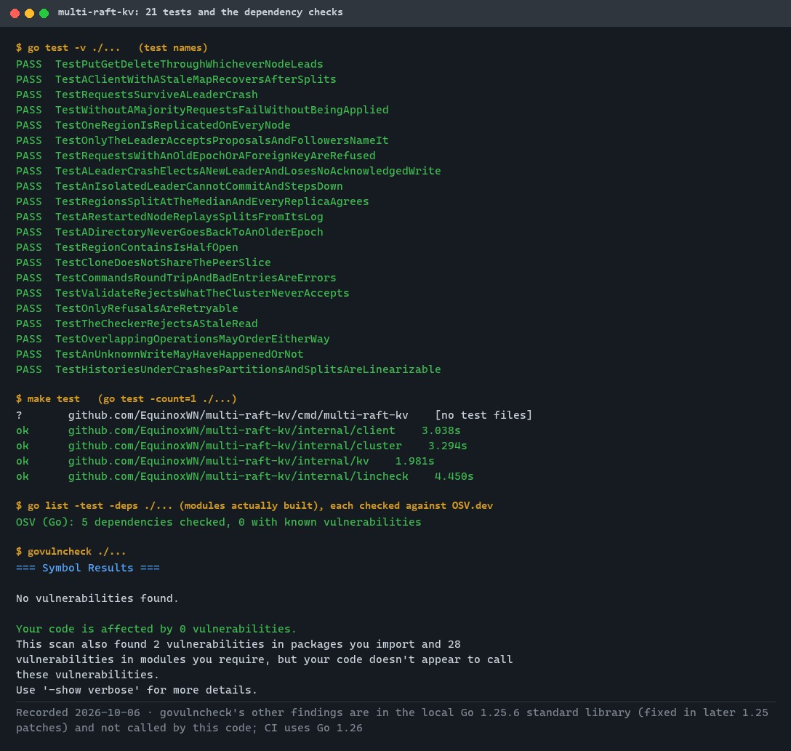
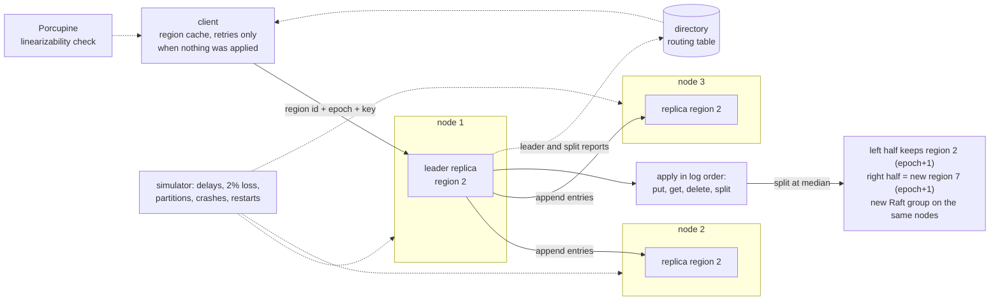
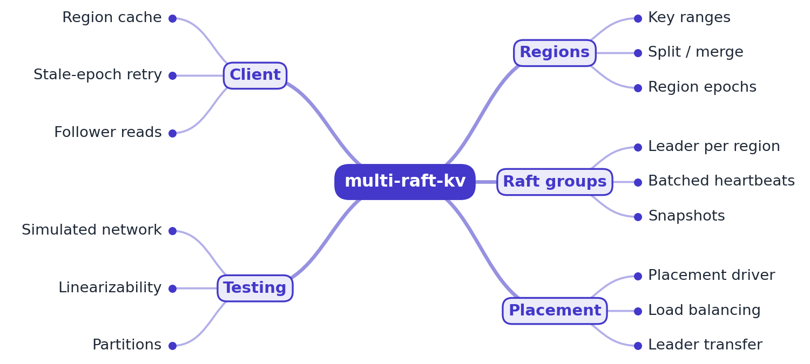
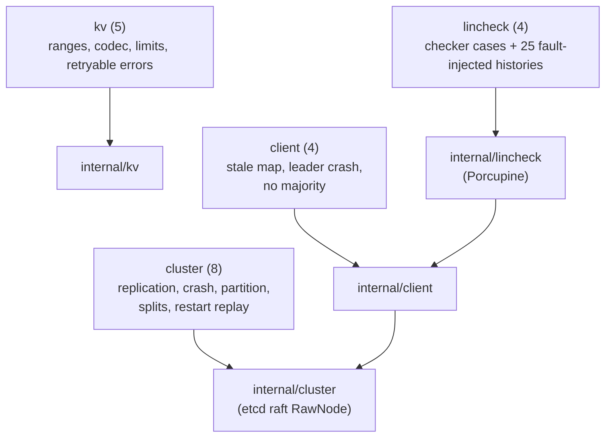

# multi-raft-kv

[](https://github.com/EquinoxWN/multi-raft-kv/actions/workflows/ci.yml)


> How a database keeps working when a server dies: a sharded, replicated key-value store that stays correct through crashes and network splits.

Part of my **Distributed Systems & Storage** list · Go · core project

## Proof it works

2,000 ordered writes split one region into 15, each with its own Raft group. Crashing the node that leads all of them moves leadership to the survivors within a few election timeouts, every key stays readable, and the restarted node rebuilds its regions by replaying its Raft logs. Then 25 fault-injected histories (crashes, partitions, 2% message loss, splits) are all linearizable:



21 tests pass, and three deliberately injected bugs (local leader reads, acknowledging before commit, no epoch check at apply) each make the suite fail:



## Architecture

**What M1 runs today:**



**Full roadmap (M1 to M3):**



## How it works

_Steps 1 and 2 are built and tested (M1); the rest is on the [roadmap](#roadmap)._

1. The key space is divided into regions (key ranges), and each region is replicated by its own Raft group across three nodes.
2. When a region grows past a size limit it splits; a region epoch number lets nodes and clients detect stale routing.
3. A placement driver watches load and moves replicas and leaders to keep the cluster balanced.
4. Clients cache the region map, retry on 'not leader' or 'stale epoch' replies, and can use follower reads for read-heavy traffic.
5. Each node batches heartbeats for all of its Raft groups, keeping thousands of groups cheap.
6. A deterministic simulator plus Porcupine verify linearizability under partitions, crashes and region moves.

## Tech stack

| Area | In M1 | Planned |
|---|---|---|
| Core | Go, etcd-io/raft, regions with splits and epochs, simulated network | gRPC transport |
| Placement | - | Placement driver for split, merge and rebalancing |
| Test | Porcupine linearizability under crashes, partitions and message loss | Fully deterministic simulation testing |

Language: **Go** (1.25+). Code in [`internal/`](internal): `kv` (regions, commands, errors), `cluster` (nodes, Raft replicas, splits, simulated network), `client` (routing and retries), `lincheck` (history recording and Porcupine); the demo is [`cmd/multi-raft-kv`](cmd/multi-raft-kv).

## Run it

**Prerequisites:** Go 1.25+. Everything runs in one process: three simulated nodes, a simulated network, no ports or containers.

```bash
make setup   # download modules
make lint    # gofmt and go vet
make test    # 21 tests, including 25 fault-injected histories checked by Porcupine
make demo    # 2,000 writes until regions split, crash the busiest leader, restart it, 25 histories
make audit   # govulncheck
```

Flags: `go run ./cmd/multi-raft-kv -keys 5000 -split 400 -seed 7 -seeds 100`.

### What a client can be told, and what it does

| Reply | Meaning | Client action |
|---|---|---|
| not leader (hint: node n) | this replica is a follower | retry at node n, or another node |
| stale epoch (current regions) | the region split since the client cached it | replace the cached region, retry |
| key not in region, region not found, node down | routed to the wrong place | drop the cache entry, ask the directory, retry |
| unknown outcome | proposed, but leadership was lost or the node crashed before the reply | never resent: it may have been applied |
| unavailable | every attempt was refused before reaching a log | nothing was applied |

## Tests and results

Full numbers, the mutation checks and the demo output: [docs/results/m1.md](docs/results/m1.md).

| Check | Result |
|---|---|
| Tests (`make test`) | **21 passed**, 0 failed (and three more runs in a row) |
| Linearizability | 25 of 25 histories linearizable: four concurrent clients, crashes, partitions, 2% message loss and splits, about 23,000 completed operations |
| Do the tests catch bugs? | local leader reads, acknowledging before commit, and a missing apply-time epoch check each make the suite fail |
| Splits | 2,000 ordered writes split one region into 15, each with its own Raft group, identical on every node |
| Leader crash | the node leading all 15 regions crashed: new leaders everywhere within 56 steps (election timeout 10 to 20), every key still readable |
| Restart | the node rebuilt all regions from its Raft logs, replaying the splits, and caught up within a few steps |
| Lint / audit | gofmt and go vet clean; every compiled dependency clean on OSV.dev; govulncheck: nothing in the code's call paths |

### Test map



## Roadmap

**M1** (≈15 h)
- [x] Write `docs/rfc/0001-design.md`: problem, goals, non-goals, chosen design
- [x] The key space is divided into regions (key ranges), and each region is replicated by its own Raft group across three nodes.
- [x] When a region grows past a size limit it splits; a region epoch number lets nodes and clients detect stale routing.

**M2** (≈20 h)
- [ ] A placement driver watches load and moves replicas and leaders to keep the cluster balanced.
- [ ] Clients cache the region map, retry on 'not leader' or 'stale epoch' replies, and can use follower reads for read-heavy traffic.

**M3** (≈25 h)
- [ ] Each node batches heartbeats for all of its Raft groups, keeping thousands of groups cheap.
- [ ] A deterministic simulator plus Porcupine verify linearizability under partitions, crashes and region moves.
- [ ] Publish the proof below with real numbers

## Proof

What this repo must show before it counts as done:

- Linearizability results over thousands of seeds, and throughput as nodes are added.

| Result | Value |
|---|---|
| M3 proof above | Not measured yet (M3). Current M1 numbers: see [Tests and results](#tests-and-results). |

## Why it matters

- **Interview angle:** 'Design a distributed key-value store', including the sharding and consistency follow-ups.
- **Upstream I'd like to contribute to:** TiKV (PingCAP) or etcd-io/raft: tests, docs and good-first issues.

## Design docs

- [RFC 0001: design](docs/rfc/0001-design.md)
- [ADR 0001: record architecture decisions](docs/adr/0001-record-architecture-decisions.md)
- [ADR 0002: etcd raft driven by a simulator](docs/adr/0002-etcd-raft-driven-by-a-simulator.md)
- [ADR 0003: splits as log entries, fenced by epochs](docs/adr/0003-splits-as-log-entries-with-epoch-fencing.md)
- [M1 results](docs/results/m1.md)

## Scope

This is a learning and portfolio system, not a hosted production service. Everything runs locally.

## Security and contributing

- Every GitHub Action is pinned to a commit SHA; workflows run read-only, without persisted credentials.
- Dependabot proposes dependency and action updates weekly.
- Log entries are decoded defensively (a malformed entry is skipped, never a panic); keys over 4 KiB and values over 64 KiB are refused before reaching Raft; CI runs `govulncheck` on every push.
- Report vulnerabilities privately: see [SECURITY.md](SECURITY.md). To contribute, see [CONTRIBUTING.md](CONTRIBUTING.md).

## License

MIT, see [LICENSE](LICENSE).
